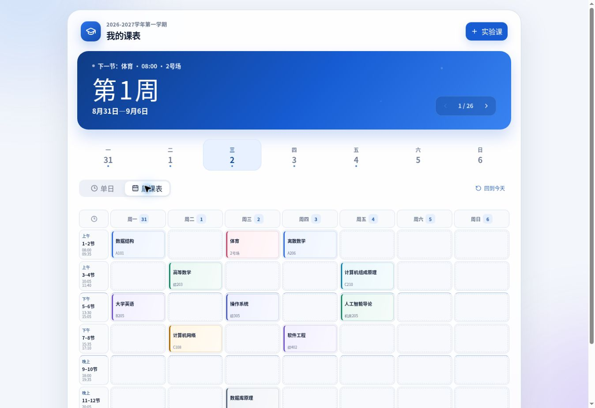

# 天扬课表

一个面向手机桌面使用的简洁个人课表：打开即可查看当天课程，不含广告，课程数据保存在本地。

[在线使用](https://tianyang-schedule.hearty-gnat-4552.chatgpt.site)



## 为什么做这个项目

教务系统查看课表步骤较多，常见课表应用又包含广告。这个项目希望把课表还原成一个安静、直接的工具：从安卓桌面打开后，马上看到今天、本周以及下一节课。

## 功能

- 单日课表与完整周课表，上午、下午、晚间课程按时间对齐
- 显示当前周日期范围，以及“正在上课 / 下一节课”状态
- 支持导入大连理工大学学生大课表 PDF
- 手动添加实验课、临时课程，并支持一次、多周或自选周次
- 点击课程查看详情、教师、教室、周次和备注
- 普通课程可按单周临时调课、停课和恢复
- 添加或修改课程时检查时间冲突，但不阻止用户保存
- JSON 数据备份与恢复
- 支持添加到安卓主屏幕和离线访问

## 数据与隐私

课程、备注、调课和停课记录默认只保存在当前浏览器的 `localStorage` 中，不会上传账号密码或课表数据。清除浏览器数据或更换设备前，请先使用“备份与恢复”导出 JSON 文件。

## 技术栈

- React 19 + TypeScript
- Next.js / Vinext
- Tailwind CSS
- Shadcn UI
- PDF.js
- Service Worker + Web App Manifest

## 本地运行

需要 Node.js 22.13 或更高版本。

```bash
git clone https://github.com/ElysiaPOI/tianyang-schedule.git
cd tianyang-schedule
npm install
npm run dev
```

开发服务器启动后，根据终端提示在浏览器中打开本地地址。

## 构建与测试

```bash
npm run build:local
npm test
```

项目的线上版本运行在 Cloudflare Workers 兼容环境中。仓库内的 Sites 配置用于当前演示站点的持续发布。

## 项目状态

当前版本已覆盖日常课表查看、临时课程、调课停课、冲突提醒以及数据备份等核心场景。后续更新将优先解决真实使用中发现的问题，保持界面简洁。

## 开源协议

本项目采用 [MIT License](LICENSE)。
